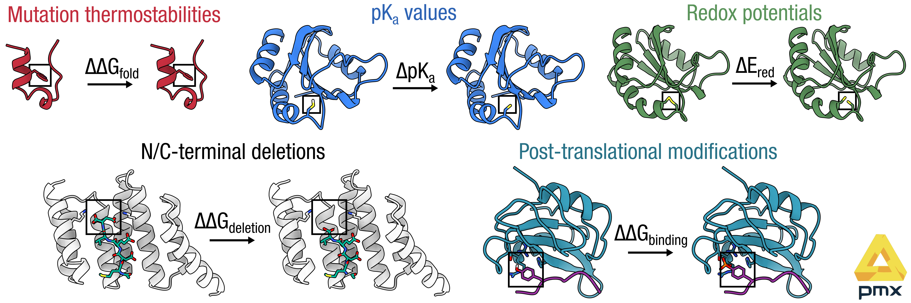

# pmx: alchemistry in gromacs — extended protein branch

[](https://travis-ci.org/deGrootLab/pmx)
[](https://codecov.io/gh/deGrootLab/pmx)

> **This is a custom fork of [deGrootLab/pmx](https://github.com/deGrootLab/pmx) (`develop` branch) with
> extended protein mutation support.** It adds hybrid residues and force-field parameters for covalent and
> non-standard protein chemistries — notably Cys–Cys disulfide formation and breaking — not present in the
> upstream release — see highlights below.



`pmx` is a Python library for setting up and analysing alchemical free-energy calculations in
[GROMACS](http://gromacs.org). Starting from a crystal structure you can build hybrid (dual-topology)
residues, generate perturbed force-field parameters, and compute ΔG via non-equilibrium switching or BAR.

## New free energy capabilities
| Feature | Hybrid code | Force field |
|---------|------------|-------------|
| Cys–Cys disulfide formation / breaking | C2CD | — |

See [`examples/`](examples/) for three worked end-to-end FEP pipelines.

More features will be added as they become available.

## Installation

```bash
# 1. Clone this repository
git clone -b develop https://github.com/wilsonjcarter/pmx.git
cd pmx

# 2. Create and activate a conda environment
conda create -n devpmx python=3.11 numpy matplotlib scipy pip jupyter pandas
conda activate devpmx

# 3. Install pmx
pip install .

# 4. Activate GROMACS (adjust path to your installation)
source /usr/local/gromacs/bin/GMXRC
```

GROMACS 2022 or newer is recommended. The `charmm36m-mut` force field is bundled with pmx and requires no separate installation.

## Citations

`pmx` is a research software. If you make use of it in scientific publications, please cite the following papers:

```bibtex
@article{Gapsys2015pmx,
    title = {pmx: Automated protein structure and topology
    generation for alchemical perturbations},
    author = {Gapsys, Vytautas and Michielssens, Servaas
    and Seeliger, Daniel and de Groot, Bert L.},
    journal = {Journal of Computational Chemistry},
    volume = {36},
    number = {5},
    pages = {348--354},
    year = {2015},
    doi = {10.1002/jcc.23804}
}

@article{Seeliger2010pmx,
    title = {Protein Thermostability Calculations Using
    Alchemical Free Energy Simulations},
    author = {Seeliger, Daniel and de Groot, Bert L.},
    journal = {Biophysical Journal},
    volume = {98},
    number = {10},
    pages = {2309--2316},
    year = {2010},
    doi = {10.1016/j.bpj.2010.01.051}
}
```

## License

`pmx` is licensed under the GNU Lesser General Public License v3.0 (LGPL v3).
