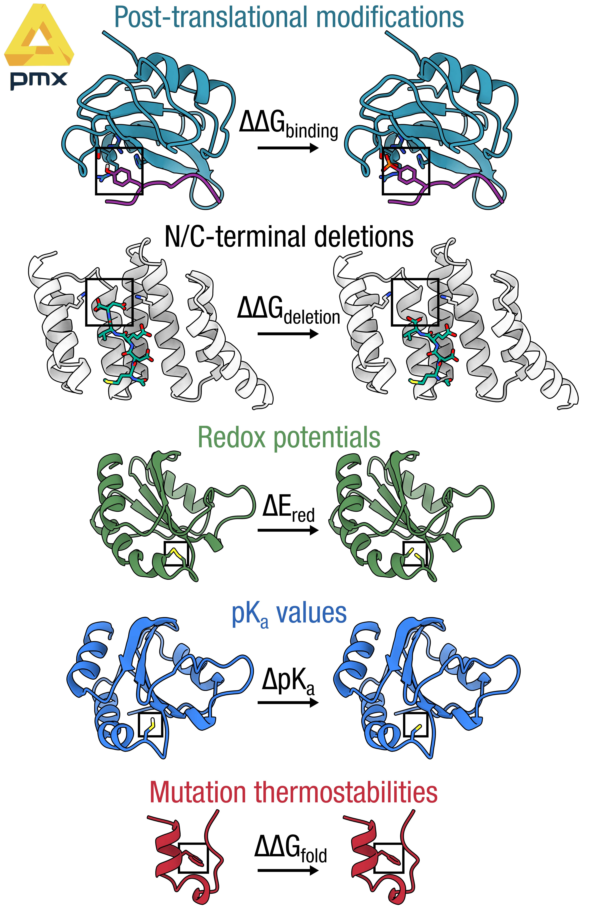

# pmx: alchemistry in gromacs — extended protein branch

[](https://travis-ci.org/deGrootLab/pmx)
[](https://codecov.io/gh/deGrootLab/pmx)

> **This is a custom fork of [deGrootLab/pmx](https://github.com/deGrootLab/pmx) (`develop` branch) with
> extended protein mutation support.** It adds hybrid residues and force-field parameters for post-translational
> modifications and non-standard chemistries not present in the upstream release — see highlights below.



`pmx` is a Python library for setting up and analysing alchemical free-energy calculations in
[GROMACS](http://gromacs.org). Starting from a crystal structure you can build hybrid (dual-topology)
residues, generate perturbed force-field parameters, and compute ΔG via non-equilibrium switching or BAR.

### What this fork adds (on top of upstream `develop`)

| Feature | Hybrid code | Force field |
|---------|------------|-------------|
| Ser → phosphoSer (mono/dianionic) | S2P1 / S2P2 | SP1/SP2 in `charmm36m-mut` |
| Thr → phosphoThr (mono/dianionic) | T2P1 / T2P2 | TP1/TP2 in `charmm36m-mut` |
| Tyr → phosphoTyr (mono/dianionic) | Y2P1 / Y2P2 | YP1/YP2 in `charmm36m-mut` |
| Cys–Cys disulfide formation / breaking | C2CD | — |
| C-terminal residue deletion | *deC | — |
| N-terminal residue deletion | *deN | — |

All phosphorylation hybrids use the same user-facing target code (`P1` monoanionic, `P2` dianionic);
pmx automatically picks the correct hybrid based on the source residue:

```bash
printf "63 P1\n" | pmx mutate -f wt.gro -o mutant.pdb -ff charmm36m-mut  # Tyr → YP1
printf "42 P1\n" | pmx mutate -f wt.gro -o mutant.pdb -ff charmm36m-mut  # Ser → SP1
printf "18 P1\n" | pmx mutate -f wt.gro -o mutant.pdb -ff charmm36m-mut  # Thr → TP1
```

See [`examples/`](examples/) for six worked end-to-end FEP pipelines.

https://degrootlab.github.io/pmx/

## Citations

`pmx` is a research software. If you make use of it in scientific publications, please cite the following papers:

```bibtex
@article{Gapsys2015pmx,
    title = {pmx: Automated protein structure and topology
    generation for alchemical perturbations},
    author = {Gapsys, Vytautas and Michielssens, Servaas
    and Seeliger, Daniel and de Groot, Bert L.},
    journal = {Journal of Computational Chemistry},
    volume = {36},
    number = {5},
    pages = {348--354},
    year = {2015},
    doi = {10.1002/jcc.23804}
}

@article{Seeliger2010pmx,
    title = {Protein Thermostability Calculations Using
    Alchemical Free Energy Simulations},
    author = {Seeliger, Daniel and de Groot, Bert L.},
    journal = {Biophysical Journal},
    volume = {98},
    number = {10},
    pages = {2309--2316},
    year = {2010},
    doi = {10.1016/j.bpj.2010.01.051}
}
```

## License

`pmx` is licensed under the GNU Lesser General Public License v3.0 (LGPL v3).
