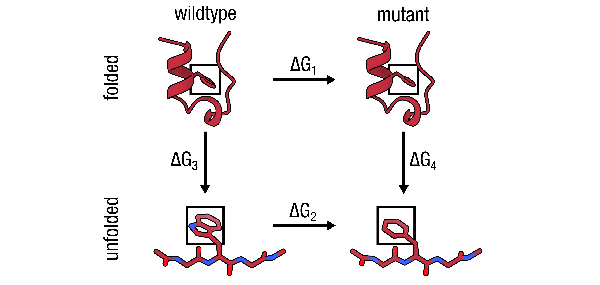

# Alchemical amino acid substitution: Trp6→Phe in Trp Cage (1L2Y)

<p align="center">
  
</p>

## TLDR

This is a standard amino acid substitution (W6F) in the Trp Cage miniprotein — the simplest pmx workflow and the recommended starting point for learning non-equilibrium free energy calculations. Trp6 is the hydrophobic anchor of the Trp Cage core; W6F is charge-neutral and experimentally characterised, making it a clean benchmark.

| Property | Value |
|---|---|
| Hybrid | W2F |
| State A | Trp (full indole side chain) |
| State B | Phe (dummy Trp atoms + Phe ring) |
| Charge shift | 0 → 0 (none) |
| Special steps | None |

```bash
# Unique mutation step for this example
printf "6 F\n" | pmx mutate -f wt.gro -o mutant.pdb -ff charmm36m-mut

# See run.sh for the complete workflow (Steps 1–9)
```

---

## Detailed walkthrough

### Step 1 — Prepare the wildtype topology

```bash
eval "$(python3 -c 'from pmx.gmx import set_gmxlib; import os; set_gmxlib(); print("export GMXLIB="+os.environ["GMXLIB"])')"

gmx pdb2gmx \
    -f      input/1L2Y.pdb \
    -o      wt.gro \
    -p      wt.top \
    -ff     charmm36m-mut \
    -water  tip3p \
    -ignh
```

`-ignh` strips all existing hydrogens so GROMACS rebuilds them consistently from the hydrogen database. The wildtype `.gro` is used only to normalise atom names before `pmx mutate`; the topology (`wt.top`) is discarded.

---

### Step 2 — Build the hybrid structure

```bash
printf "6 F\n" | pmx mutate \
    -f      wt.gro \
    -o      mutant.pdb \
    -ff     charmm36m-mut
```

`pmx mutate` replaces Trp6 with the `W2F` hybrid, keeping the full Trp side chain as state A atoms and adding dummy Phe atoms for state B. The mutation code `F` is the one-letter code of the target residue.

---

### Step 3 — Build the hybrid topology

```bash
gmx pdb2gmx \
    -f      mutant.pdb \
    -o      processed.gro \
    -p      topol.top \
    -ff     charmm36m-mut \
    -water  tip3p
```

Do **not** pass `-ignh` — `pmx mutate` has already positioned all hydrogens and dummy atoms. `pdb2gmx` reads the `W2F` entry from `mutres.rtp` and generates a standard topology that includes all hybrid atoms.

---

### Step 4 — Fill B-state bonded terms

```bash
pmx gentop \
    -p  topol.top \
    -o  pmxtop.top \
    -ff charmm36m-mut
```

`pmx gentop` reads the `W2F` entry from `mutres.mtp` and fills in the B-state atom types, charges, and bonded parameters; dummy atoms get type `DUM_*`, charge 0, and ε = 0.

Expected output:
```
log_> Hybrid Residue -> 6 | W2F
log_> Making bonds for state B -> ...
log_> Total charge of state A =  0
log_> Total charge of state B =  0
```

---

### Step 5 — Define box, solvate, and add ions

`gmx editconf` defines the simulation box before solvation. For the Trp Cage miniprotein a
truncated-octahedron (dodecahedron) with 1.2 nm to the box wall is standard.

```bash
gmx editconf -f processed.gro -o boxed.gro -bt dodecahedron -d 1.2

gmx solvate -cp boxed.gro -cs spc216.gro -p pmxtop.top -o solvated.gro

gmx grompp -f mdp/em.mdp -c solvated.gro -r solvated.gro \
           -p pmxtop.top -o ions.tpr -maxwarn 1
printf '13\n' | gmx genion -s ions.tpr -pname K -nname CL \
           -neutral -conc 0.15 -o ions.gro -p pmxtop.top
```

---

### Step 6 — Energy minimise

```bash
gmx grompp -f mdp/em.mdp -c ions.gro -r ions.gro \
           -p pmxtop.top -o em.tpr -maxwarn 1
gmx mdrun -v -deffnm em -ntmpi 1
```

---

### Step 7 — Equilibrate and run endpoint simulations

```bash
mkdir -p stateA
gmx grompp -f mdp/eqA.mdp -c em.gro -r em.gro \
           -p pmxtop.top -o stateA/md.tpr -maxwarn 1
gmx mdrun -v -deffnm stateA/md

mkdir -p stateB
gmx grompp -f mdp/eqB.mdp -c em.gro -r em.gro \
           -p pmxtop.top -o stateB/md.tpr -maxwarn 1
gmx mdrun -v -deffnm stateB/md
```

Allow at least 10 ns equilibration per endpoint before harvesting transition frames. The Trp Cage is small (20 residues) and equilibrates quickly.

---

### Step 8 — Non-equilibrium transition simulations

```bash
mkdir -p transitionA
printf '0\n' | gmx trjconv -f stateA/md.trr -s stateA/md.tpr \
    -b 5000 -sep -o transitionA/frame.pdb

for i in $(seq 0 99); do
    mkdir -p transitionA/frame${i}
    mv transitionA/frame${i}.pdb transitionA/frame${i}/initial.pdb
    gmx grompp -f mdp/tiA.mdp \
        -c transitionA/frame${i}/initial.pdb \
        -r transitionA/frame${i}/initial.pdb \
        -p pmxtop.top -o transitionA/frame${i}/ti.tpr -maxwarn 1
    gmx mdrun -v -deffnm transitionA/frame${i}/ti
done

mkdir -p transitionB
printf '0\n' | gmx trjconv -f stateB/md.trr -s stateB/md.tpr \
    -b 5000 -sep -o transitionB/frame.pdb

for i in $(seq 0 99); do
    mkdir -p transitionB/frame${i}
    mv transitionB/frame${i}.pdb transitionB/frame${i}/initial.pdb
    gmx grompp -f mdp/tiB.mdp \
        -c transitionB/frame${i}/initial.pdb \
        -r transitionB/frame${i}/initial.pdb \
        -p pmxtop.top -o transitionB/frame${i}/ti.tpr -maxwarn 1
    gmx mdrun -v -deffnm transitionB/frame${i}/ti
done
```

---

### Step 9 — Analyse

```bash
pmx analyze \
    -fA transitionA/frame*/ti.xvg \
    -fB transitionB/frame*/ti.xvg
```

`results.txt` gives ΔG1 (Trp→Phe free energy cost in the protein). Repeat Steps 1–9 with a short Trp-containing reference peptide in water to get ΔG2, then:

```
ΔΔG = ΔG1 − ΔG2
```

A positive ΔΔG means the mutation destabilises the folded protein relative to the unfolded reference.
