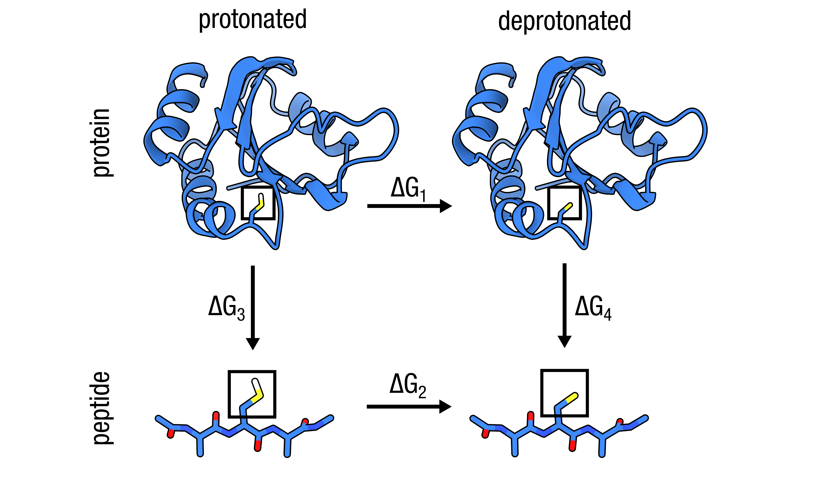

# Alchemical pKa shift: Cys32 CYS→CYM in thioredoxin (1ERT)

<p align="center">
  
</p>

## TLDR

This example computes the pKa shift of an active-site cysteine by alchemically removing its thiol proton — the standard pmx approach for residue pKa predictions. Thioredoxin Cys32 has an anomalously low pKa (~6.3 vs the solution reference of 8.3), driven by local electrostatics and quantified here as ΔΔG ≈ −2.7 kcal/mol.

| Property | Value |
|---|---|
| Hybrid | C2CM |
| State A | Protonated Cys (SG type S, HG1 present) |
| State B | Deprotonated thiolate (SG→SM, HG1→DUM_HS) |
| Charge shift | 0 → −1 — **doublebox required** (see below) |
| Special steps | None |

```bash
# Unique mutation step for this example
printf "32 CM\n" | pmx mutate -f wt.gro -o mutant.pdb -ff charmm36m-mut

# See run.sh for the complete workflow (Steps 1–9)
```

---

## Detailed walkthrough

### Step 1 — Prepare the wildtype topology

```bash
eval "$(python3 -c 'from pmx.gmx import set_gmxlib; import os; set_gmxlib(); print("export GMXLIB="+os.environ["GMXLIB"])')"

gmx pdb2gmx \
    -f      input/1ERT.pdb \
    -o      wt.pdb \
    -p      wt.top \
    -ff     charmm36m-mut \
    -water  tip3p \
    -ignh
```

`-ignh` strips all existing hydrogens so GROMACS rebuilds them consistently. The wildtype `.gro` is used only to normalise atom names before `pmx mutate`; the topology (`wt.top`) is discarded.

---

### Step 2 — Build the hybrid structure

```bash
printf "32\nCM\nn\n" | pmx mutate \
    -f      wt.pdb \
    -o      mutant.pdb \
    -ff     charmm36m-mut
```

`pmx mutate` replaces Cys32 with the `C2CM` hybrid using mutation code `CM` (pmx extended one-letter code for CYM). State A retains the full `SH` group; state B carries a dummy `HG1` (`DUM_HS`) so the topology has the same number of atoms throughout.

---

### Step 3 — Build the reference structure
```bash
printf '3\n4\n' | gmx pdb2gmx \
    -f      input/ref_peptide.pdb \
    -o      ref_wt.pdb \
    -p      ref_wt.top \
    -ff     charmm36m-mut \
    -water  tip3p \
    -ter \
    -ignh

printf "3\nC\nn\n" | pmx mutate \
    -f      ref_wt.pdb \
    -o      ref_mutant.pdb \
    -ff     charmm36m-mut
```


### Step 4 - Sharge-neutral setup with pmx doublebox

Deprotonation shifts the system charge from 0 to −1 (relative to the wildtype). In a periodic simulation box this charge change introduces finite-size artefacts that can bias ΔG by several kJ/mol. The correct approach is the **single-box double-system** method: place the protein system and a reference peptide in the *same* box so that one gains charge while the other loses it, keeping the total box charge constant throughout the alchemical transition.

```
                          alchemical λ: 0 → 1
  protein in box:  CYS  ──────────────────────►  CYM     Δq = −1
  reference in box: CYM ──────────────────────►  CYS     Δq = +1
  ─────────────────────────────────────────────────────────────────
  net charge change in box:                                    0  ✓
```

ΔΔG is recovered directly from the combined work values: `pmx analyze` sees the total work of both simultaneous transformations, and the reference cancels the solvation component, leaving only the protein-environment contribution. This directly gives the pKa shift via ΔΔG = ΔpKa × RT ln(10).


#### Step 4a — Combine into one box

```bash
pmx doublebox \
    -f1 mutant.pdb \
    -f2 ref_mutant.pdb \
    -o  doublebox.pdb \
    -r  2.5 \
    -d  1.5
```

#### Step 4b — Build the doublebox topology

```bash
printf '0\n0\n3\n4\n' | gmx pdb2gmx \
    -f      doublebox.pdb \
    -o      gmx_doublebox.pdb \
    -p      topol.top \
    -ff     charmm36m-mut \
    -ter \
    -water  tip3p
```

Do **not** pass `-ignh` — `pmx mutate` has already positioned all hydrogens and dummy atoms. Because Cys32 is renamed `C2CM` (not `CYS`), `pdb2gmx` will not attempt to form a disulfide involving it.

---

### Step 5 — Fill B-state bonded terms

```bash
pmx gentop \
    -p  topol.top \
    -o  pmxtop.top \
    -ff charmm36m-mut
```

`pmx gentop` reads the `C2CM` entry from `mutres.mtp` and fills in the B-state atom types, charges, and bonded parameters for Cys32.

Expected output:
```
log_> Reading input itp file "topol_Protein_chain_A.itp""
log_> Scanning database for C2CM
log_> Hybrid Residue -> 32 | C2CM
log_> Making bonds for state B -> 12 bonds with perturbed atoms
log_> Making angles for state B -> 23 angles with perturbed atoms
log_> Making dihedrals for state B -> 16 dihedrals with perturbed atoms
log_> Removed 0 fake dihedrals
log_> Total charge of state A = -5
log_> Total charge of state B = -6

log_> Reading input itp file "topol_Protein_chain_B.itp""
log_> Scanning database for CM2C
log_> Hybrid Residue -> 3 | CM2C
log_> Making bonds for state B -> 12 bonds with perturbed atoms
log_> Making angles for state B -> 23 angles with perturbed atoms
log_> Making dihedrals for state B -> 16 dihedrals with perturbed atoms
log_> Removed 0 fake dihedrals
log_> Total charge of state A = -1
log_> Total charge of state B = 0
```

Notice that while our the the protein charge goes from -5 to -6 and the peptide goes from -1 to 0, our single-box double-system approach ensures the system charge remains zero.

---

### Step 6 — Solvate and add ions

```bash
# Solvate the combined box
gmx solvate -cp doublebox.gro -cs spc216.gro \
            -p pmxtop.top -o solvated.pdb

# Add ions — system is charge-neutral by construction
gmx grompp -f mdp/em.mdp -c solvated.pdb -r solvated.gro \
           -p pmxtop.top -o ions.tpr -maxwarn 1

printf '13\n' | gmx genion -s ions.tpr -pname K -nname CL \
           -neutral -conc 0.15 -o ions.pdb -p pmxtop.top
```
### Step 7 — Energy minimise

```bash
gmx grompp -f mdp/em.mdp -c ions.gro -r ions.gro \
           -p pmxtop.top -o em.tpr -maxwarn 1
gmx mdrun -v -deffnm em -ntmpi 1
```

---

### Step 8 — Equilibrate and run endpoint simulations

```bash
mkdir -p stateA
gmx grompp -f mdp/eqA.mdp -c em.gro -r em.gro \
           -p pmxtop.top -o stateA/md.tpr -maxwarn 1
gmx mdrun -v -deffnm stateA/md

mkdir -p stateB
gmx grompp -f mdp/eqB.mdp -c em.gro -r em.gro \
           -p pmxtop.top -o stateB/md.tpr -maxwarn 1
gmx mdrun -v -deffnm stateB/md
```

Allow at least 10 ns equilibration per endpoint; the protonation state affects the local hydrogen-bond network around the active site, which needs time to reorganise.

---

### Step 9 — Non-equilibrium transition simulations

```bash
mkdir -p transitionA
printf '0\n' | gmx trjconv -f stateA/md.trr -s stateA/md.tpr \
    -b 5000 -sep -o transitionA/frame.pdb

for i in $(seq 0 99); do
    mkdir -p transitionA/frame${i}
    mv transitionA/frame${i}.pdb transitionA/frame${i}/initial.pdb
    gmx grompp -f mdp/tiA.mdp \
        -c transitionA/frame${i}/initial.pdb \
        -r transitionA/frame${i}/initial.pdb \
        -p pmxtop.top -o transitionA/frame${i}/ti.tpr -maxwarn 1
    gmx mdrun -v -deffnm transitionA/frame${i}/ti
done

mkdir -p transitionB
printf '0\n' | gmx trjconv -f stateB/md.trr -s stateB/md.tpr \
    -b 5000 -sep -o transitionB/frame.pdb

for i in $(seq 0 99); do
    mkdir -p transitionB/frame${i}
    mv transitionB/frame${i}.pdb transitionB/frame${i}/initial.pdb
    gmx grompp -f mdp/tiB.mdp \
        -c transitionB/frame${i}/initial.pdb \
        -r transitionB/frame${i}/initial.pdb \
        -p pmxtop.top -o transitionB/frame${i}/ti.tpr -maxwarn 1
    gmx mdrun -v -deffnm transitionB/frame${i}/ti
done
```

---

### Step 10 — Analyse

Because both legs (protein and reference peptide) run simultaneously in the same box, `pmx analyze` operates on the combined work values and directly yields ΔΔG:

```bash
pmx analyze \
    -fA transitionA/frame*/ti.xvg \
    -fB transitionB/frame*/ti.xvg
```

The output ΔG is already ΔΔG = ΔG(deprotonation in protein) − ΔG(deprotonation in water). Convert to a pKa shift via:

```
pKa = pKa_ref + ΔΔG / (RT ln 10)
```

Using pKa_ref = 8.3 (solution Cys), a negative ΔΔG means deprotonation is more favourable in the protein → lower pKa. Cys32 in thioredoxin gives pKa ≈ 6.3, consistent with ΔΔG ≈ −2.7 kcal/mol.
