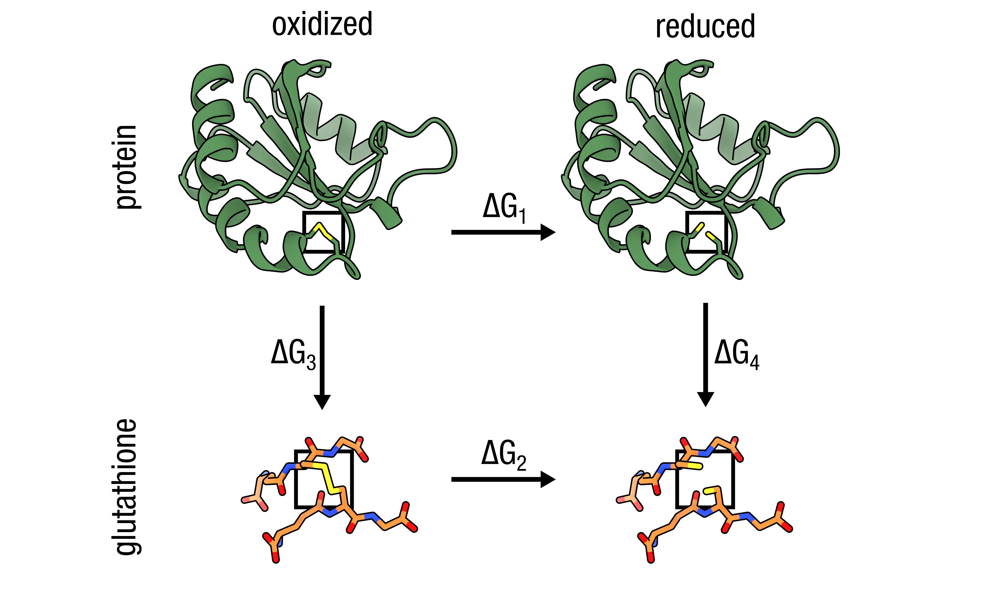

# Alchemical disulfide formation: C2CD hybrid residues (1ERT thioredoxin)

<p align="center">
  
</p>

## TLDR

This example computes the alchemical free energy of disulfide bond formation between Cys32 and Cys35 in thioredoxin, where both partner cysteines must be mutated simultaneously to the `C2CD` hybrid. The transformation is charge-neutral (both states 0→0), and `pmx gentop` automatically inserts the cross-residue Sγ–Sγ bond along with all flanking angle and dihedral terms.

| Property | Value |
|---|---|
| Hybrid | C2CD (applied to both Cys32 and Cys35) |
| State A | Two free thiols (SG type S, HG1 present) |
| State B | Disulfide (SG→SM, HG1→DUM_HS on each Cys) |
| Charge shift | 0 → 0 (none) |
| Special steps | Must mutate two residues; `pmx gentop` inserts the Sγ–Sγ bond |

```bash
# Unique mutation steps for this example — both cysteines must be mutated
printf "32 CD\n" | pmx mutate -f wt.gro -o mutant_step1.pdb -ff charmm36m-mut
printf "35 CD\n" | pmx mutate -f mutant_step1.pdb -o mutant.pdb -ff charmm36m-mut

# See run.sh for the complete workflow (Steps 1–9)
```

---

## Detailed walkthrough

### Step 1 — Prepare the wildtype topology

```bash
eval "$(python3 -c 'from pmx.gmx import set_gmxlib; import os; set_gmxlib(); print("export GMXLIB="+os.environ["GMXLIB"])')"

gmx pdb2gmx \
    -f      input/1ERT.pdb \
    -o      wt.gro \
    -p      wt.top \
    -ff     charmm36m-mut \
    -water  tip3p \
    -ignh
```

`-ignh` strips all existing hydrogens so GROMACS can re-add them consistently. The wildtype `.gro` is only needed to normalise atom names for the subsequent `pmx mutate` calls; the topology (`wt.top`) is discarded.

---

### Step 2 — Apply both C2CD mutations

Each `pmx mutate` call takes the output of the previous step so that the two mutations do not overwrite each other.

```bash
# Cys32 → C2CD
printf "32 CD\n" | pmx mutate \
    -f  wt.gro \
    -o  mutant_step1.pdb \
    -ff charmm36m-mut

# Cys35 → C2CD  (applied on top of the first mutant)
printf "35 CD\n" | pmx mutate \
    -f  mutant_step1.pdb \
    -o  mutant.pdb \
    -ff charmm36m-mut
```

The mutation code `CD` selects the `C2CD` hybrid; both Cys32 and Cys35 are labelled `C2CD` in the output PDB, with B-state dummy atoms placed for each.

---

### Step 3 — Build the hybrid topology

```bash
gmx pdb2gmx \
    -f      mutant.pdb \
    -o      processed.gro \
    -p      topol.top \
    -ff     charmm36m-mut \
    -water  tip3p
```

Do **not** pass `-ignh`; `pmx mutate` has already positioned all hydrogens and dummy atoms. Because the residues are named `C2CD` (not `CYS`), `pdb2gmx` will not attempt to form a standard (non-alchemical) disulfide bond.

---

### Step 4 — Fill B-state bonded terms

```bash
pmx gentop \
    -p  topol.top \
    -o  pmxtop.top \
    -ff charmm36m-mut
```

`pmx gentop` finds both `C2CD` hybrid residues and automatically injects the cross-residue Sγ–Sγ bond, all flanking angles and dihedrals, and dummy atom parameters for state B.

Expected output:
```
log_> Hybrid Residue -> 32 | C2CD
log_> Hybrid Residue -> 35 | C2CD
log_> Making bonds for state B -> 32 bonds with perturbed atoms
log_> Making angles for state B -> 66 angles with perturbed atoms
log_> Making dihedrals for state B -> 58 dihedrals with perturbed atoms
log_> Removed 12 fake dihedrals
log_> Total charge of state A = -5
log_> Total charge of state B = -5
```

---

### Step 5 — Define box, solvate, and add ions

`gmx editconf` defines the simulation box before solvation. A dodecahedron with 1.2 nm to
the box wall is standard for thioredoxin.

```bash
gmx editconf -f processed.gro -o boxed.gro -bt dodecahedron -d 1.2

gmx solvate -cp boxed.gro -cs spc216.gro -p pmxtop.top -o solvated.gro

gmx grompp -f mdp/em.mdp -c solvated.gro -r solvated.gro \
           -p pmxtop.top -o ions.tpr -maxwarn 1
printf '13\n' | gmx genion -s ions.tpr -pname K -nname CL \
           -neutral -conc 0.15 -o ions.gro -p pmxtop.top
```

---

### Step 6 — Energy minimise

```bash
gmx grompp -f mdp/em.mdp -c ions.gro -r ions.gro \
           -p pmxtop.top -o em.tpr -maxwarn 1
gmx mdrun -v -deffnm em -ntmpi 1
```

---

### Step 7 — Equilibrate and run endpoint simulations

```bash
# State A — reduced form
mkdir -p stateA
gmx grompp -f mdp/eqA.mdp -c em.gro -r em.gro \
           -p pmxtop.top -o stateA/md.tpr -maxwarn 1
gmx mdrun -v -deffnm stateA/md

# State B — oxidised form
mkdir -p stateB
gmx grompp -f mdp/eqB.mdp -c em.gro -r em.gro \
           -p pmxtop.top -o stateB/md.tpr -maxwarn 1
gmx mdrun -v -deffnm stateB/md
```

The Sγ–Sγ distance in 1ERT (reduced form) is ~3.9 Å; allow at least 5 ns equilibration at each endpoint before harvesting transition frames.

---

### Step 8 — Non-equilibrium transition simulations

```bash
# Extract frames from state A (discard 5 ns equilibration, 100 frames from 10 ns)
mkdir -p transitionA
printf '0\n' | gmx trjconv -f stateA/md.trr -s stateA/md.tpr \
    -b 5000 -sep -o transitionA/frame.pdb

for i in $(seq 0 99); do
    mkdir -p transitionA/frame${i}
    mv transitionA/frame${i}.pdb transitionA/frame${i}/initial.pdb
    gmx grompp -f mdp/tiA.mdp \
        -c transitionA/frame${i}/initial.pdb \
        -r transitionA/frame${i}/initial.pdb \
        -p pmxtop.top -o transitionA/frame${i}/ti.tpr -maxwarn 1
    gmx mdrun -v -deffnm transitionA/frame${i}/ti
done

# Repeat for state B
mkdir -p transitionB
printf '0\n' | gmx trjconv -f stateB/md.trr -s stateB/md.tpr \
    -b 5000 -sep -o transitionB/frame.pdb

for i in $(seq 0 99); do
    mkdir -p transitionB/frame${i}
    mv transitionB/frame${i}.pdb transitionB/frame${i}/initial.pdb
    gmx grompp -f mdp/tiB.mdp \
        -c transitionB/frame${i}/initial.pdb \
        -r transitionB/frame${i}/initial.pdb \
        -p pmxtop.top -o transitionB/frame${i}/ti.tpr -maxwarn 1
    gmx mdrun -v -deffnm transitionB/frame${i}/ti
done
```

---

### Step 9 — Analyse

```bash
pmx analyze \
    -fA transitionA/frame*/ti.xvg \
    -fB transitionB/frame*/ti.xvg
```

`results.txt` gives ΔG1 (disulfide formation free energy in the protein). Repeat Steps 1–9 with a short Cys–Cys reference peptide to obtain ΔG2, then:

```
ΔΔG = ΔG1 − ΔG2
```

A negative ΔΔG indicates the disulfide is more stable in the protein than in the reference compound.
