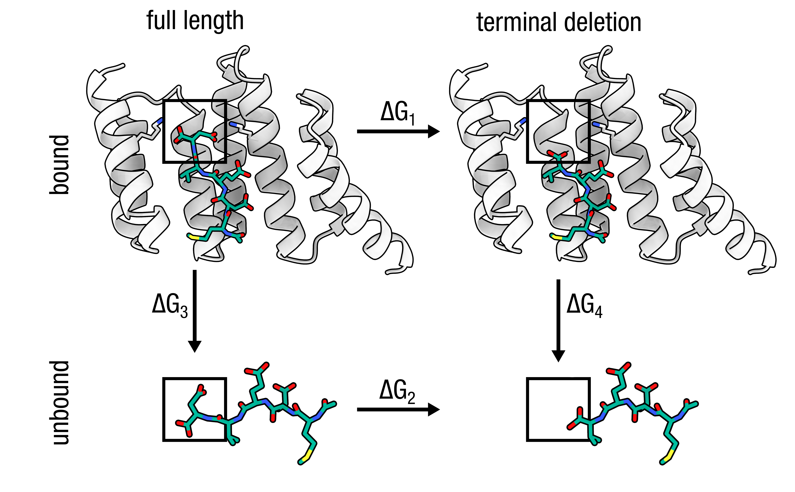

# Alchemical C-terminal residue deletion: HSP90 MEEVD peptide (1ELR)

<p align="center">
  
</p>

## TLDR

This example computes the free energy cost of truncating a C-terminal residue (Asp5) from the HSP90 MEEVD peptide, making it the only pmx workflow that uses the `DEL` mutation code and the specially generated `XdeC`/`XdeN` hybrid types. The neighbouring Val4 is renamed to `VdeC` and grows a dummy C-terminal oxygen (`DOT2`) that becomes real in state B, while Asp5 is fully dummified — a physically distinct treatment from a standard residue swap.

| | |
|---|---|
| **Hybrid** | `VdeC` (on Val4) |
| **State A** | Val4 + Asp5 (fully interacting); charge −3 |
| **State B** | Val4 as new C-terminus; Asp5 dummified; charge −2 |
| **Charge shift** | −3 → −2 (+1) — **doublebox required** (see below) |
| **Special steps** | Run `generate_term_deletion` first; copy `mutres_term.rtp/.mtp` to FF dir |

```bash
# Unique mutation step — see run.sh for the full pipeline
printf "5 DEL\n" | pmx mutate \
    -f  wt.gro \
    -o  mutant.pdb \
    -ff charmm36m-mut
```

---

## Detailed walkthrough

## Step 1 — Prepare the wildtype topology

Run `pdb2gmx` to normalise atom names (especially the backbone amide hydrogen) before passing the structure to `pmx mutate`. The output `.gro` is the only product needed from this step; `wt.top` is discarded.

```bash
eval "$(python3 -c 'from pmx.gmx import set_gmxlib; import os; set_gmxlib(); print("export GMXLIB="+os.environ["GMXLIB"])')"

gmx pdb2gmx \
    -f      input/1ELR_peptide.pdb \
    -o      wt.gro \
    -p      wt.top \
    -ff     charmm36m-mut \
    -water  tip3p \
    -ignh
```

---

## Step 2 — Generate terminal-deletion parameters

The `XdeN`/`XdeC` hybrid entries are not part of the standard mutres files and must be generated once per force field. `run.sh` copies the output into the FF directory automatically.

```bash
eval "$(python3 -c 'from pmx.gmx import set_gmxlib; import os; set_gmxlib(); print("export GMXLIB="+os.environ["GMXLIB"])')"
FFDIR=$(python3 -c "import os; from pmx.gmx import set_gmxlib; set_gmxlib(); \
    print(os.environ['GMXLIB']+'/charmm36m-mut.ff')")

python3 -m pmx.scripts.generate_term_deletion \
    --ffdir "$FFDIR" \
    --outdir .
```

---

## Step 3 — Build the hybrid structure

Target the residue to be **deleted** with the code `DEL`. `pmx` detects that Asp5 is the C-terminus and automatically renames Val4 → `VdeC` and adds the dummy oxygen `DOT2`; Asp5 stays physically in the structure and is dummified later.

```bash
printf "5 DEL\n" | pmx mutate \
    -f      wt.gro \
    -o      mutant.pdb \
    -ff     charmm36m-mut
```

---

## Step 4 — Build the hybrid topology

Copy the generated hybrid parameters into the FF directory so `pdb2gmx` can resolve `VdeC`, then process the mutant. Do **not** pass `-ignh` — the dummy atom `DOT2` placed by `pmx mutate` must be preserved.

```bash
# Copy hybrid RTP/MTP into the FF directory so pdb2gmx can find VdeC
FFDIR=$(python3 -c "import os; from pmx.gmx import set_gmxlib; set_gmxlib(); \
    print(os.environ['GMXLIB']+'/charmm36m-mut.ff')")
cp mutres_term.rtp "$FFDIR/"
cp mutres_term.mtp "$FFDIR/"

gmx pdb2gmx \
    -f      mutant.pdb \
    -o      processed.gro \
    -p      topol.top \
    -ff     charmm36m-mut \
    -water  tip3p
```

---

## Step 5 — Fill B-state bonded terms

`pmx gentop` locates the `VdeC` hybrid, dummifies Asp5 in state B, applies the C-terminal patch to Val4, and zeroes B-state force constants on dihedrals crossing the Val4–Asp5 boundary. The charge change (−3 → −2, Δq = +1) requires the doublebox approach described in Step 6.

```bash
pmx gentop \
    -p          topol.top \
    -o          pmxtop.top \
    -ff         charmm36m-mut \
    --extra_mtp mutres_term.mtp
```

Expected output:
```
log_> Hybrid Residue -> 4 | VdeC
log_> Dummifying deletion target: 5 | ASP
log_> Making bonds for state B -> 30 bonds with perturbed atoms
log_> Making angles for state B -> 56 angles with perturbed atoms
log_> Making dihedrals for state B -> 49 dihedrals with perturbed atoms
log_> Removed 2 fake dihedrals
log_> Total charge of state A = -3
log_> Total charge of state B = -2
log_> Decoupling cross-residue dihedrals: VdeC (res 4) -- ASP (res 5)
log_> Zeroed B-state for 13 dihedrals
```

---

## Step 6 — Charge-neutral setup with pmx doublebox

Deleting Asp5 shifts the system charge from −3 to −2 (Δq = +1, net loss of the two C-terminal
carboxylates of Asp minus the one gained by Val becoming the new C-terminus). In a periodic
box this charge change introduces finite-size artefacts. The correct approach is the
**single-box double-system** method:

```
                          alchemical λ: 0 → 1
  complex in box:  MEEVD (bound) ──────────────────────►  MEEV (bound)    Δq = +1
  peptide in box:  MEEV  (free)  ──────────────────────►  MEEVD (free)    Δq = −1
  ──────────────────────────────────────────────────────────────────────────────────
  net charge change in box:                                                     0  ✓
```

The reference is the **MEEVD peptide itself** (the same `1ELR_peptide.pdb`) free in water —
not a minimal dipeptide. The protein leg uses the **full co-chaperone complex** (TPR domain +
MEEVD peptide from 1ELR). The combined ΔΔG directly gives the binding free energy difference
between MEEV and MEEVD for the co-chaperone: how much does losing the C-terminal Asp cost in
binding affinity?

#### 6a — Prepare the reference leg (MEEVD peptide free in water)

```bash
# The reference is the same MEEVD peptide, free in solution
gmx pdb2gmx \
    -f      input/1ELR_peptide.pdb \
    -o      ref_wt.gro \
    -p      ref_wt.top \
    -ff     charmm36m-mut \
    -water  tip3p \
    -ignh

printf "5 DEL\n" | pmx mutate \
    -f      ref_wt.gro \
    -o      ref_mutant.pdb \
    -ff     charmm36m-mut
rm -f ref_wt.gro ref_wt.top

gmx pdb2gmx \
    -f      ref_mutant.pdb \
    -o      ref_processed.gro \
    -p      ref_topol.top \
    -ff     charmm36m-mut \
    -water  tip3p

pmx gentop \
    -p          ref_topol.top \
    -o          ref_pmxtop.top \
    -ff         charmm36m-mut \
    --extra_mtp mutres_term.mtp
```

#### 6b — Combine into one box

```bash
pmx doublebox \
    -f1 processed.gro \
    -f2 ref_processed.gro \
    -o  doublebox.gro \
    -r  2.5 \
    -d  1.5
```

#### 6c — Merge topologies, solvate, and add ions

```bash
gmx solvate -cp doublebox.gro -cs spc216.gro \
            -p pmxtop.top -o solvated.gro

gmx grompp -f mdp/em.mdp -c solvated.gro -r solvated.gro \
           -p pmxtop.top -o ions.tpr -maxwarn 1
printf '13\n' | gmx genion -s ions.tpr -pname K -nname CL \
           -neutral -conc 0.15 -o ions.gro -p pmxtop.top
```

---

## Step 7 — Energy minimise

```bash
gmx grompp -f mdp/em.mdp -c ions.gro -r ions.gro \
           -p pmxtop.top -o em.tpr -maxwarn 1
gmx mdrun -v -deffnm em -ntmpi 1
```

---

## Step 8 — Equilibrate and run endpoint simulations

```bash
mkdir -p stateA
gmx grompp -f mdp/eqA.mdp -c em.gro -r em.gro \
           -p pmxtop.top -o stateA/md.tpr -maxwarn 1
gmx mdrun -v -deffnm stateA/md

mkdir -p stateB
gmx grompp -f mdp/eqB.mdp -c em.gro -r em.gro \
           -p pmxtop.top -o stateB/md.tpr -maxwarn 1
gmx mdrun -v -deffnm stateB/md
```

---

## Step 9 — Non-equilibrium transition simulations

```bash
mkdir -p transitionA
printf '0\n' | gmx trjconv -f stateA/md.trr -s stateA/md.tpr \
    -b 5000 -sep -o transitionA/frame.pdb

for i in $(seq 0 99); do
    mkdir -p transitionA/frame${i}
    mv transitionA/frame${i}.pdb transitionA/frame${i}/initial.pdb
    gmx grompp -f mdp/tiA.mdp \
        -c transitionA/frame${i}/initial.pdb \
        -r transitionA/frame${i}/initial.pdb \
        -p pmxtop.top -o transitionA/frame${i}/ti.tpr -maxwarn 1
    gmx mdrun -v -deffnm transitionA/frame${i}/ti
done

mkdir -p transitionB
printf '0\n' | gmx trjconv -f stateB/md.trr -s stateB/md.tpr \
    -b 5000 -sep -o transitionB/frame.pdb

for i in $(seq 0 99); do
    mkdir -p transitionB/frame${i}
    mv transitionB/frame${i}.pdb transitionB/frame${i}/initial.pdb
    gmx grompp -f mdp/tiB.mdp \
        -c transitionB/frame${i}/initial.pdb \
        -r transitionB/frame${i}/initial.pdb \
        -p pmxtop.top -o transitionB/frame${i}/ti.tpr -maxwarn 1
    gmx mdrun -v -deffnm transitionB/frame${i}/ti
done
```

---

## Step 10 — Analyse

Because both legs (co-chaperone complex and free MEEVD peptide) run simultaneously in the
same box, `pmx analyze` operates on the combined work values and directly yields ΔΔG:

```bash
pmx analyze \
    -fA transitionA/frame*/ti.xvg \
    -fB transitionB/frame*/ti.xvg
```

```
ΔΔG = ΔG(Asp5 deletion in complex) − ΔG(Asp5 deletion of free peptide)
     = ΔΔG of co-chaperone binding: MEEV vs MEEVD
```

A positive ΔΔG means MEEV binds less tightly than MEEVD — the C-terminal Asp contributes
favourably to co-chaperone recognition.
