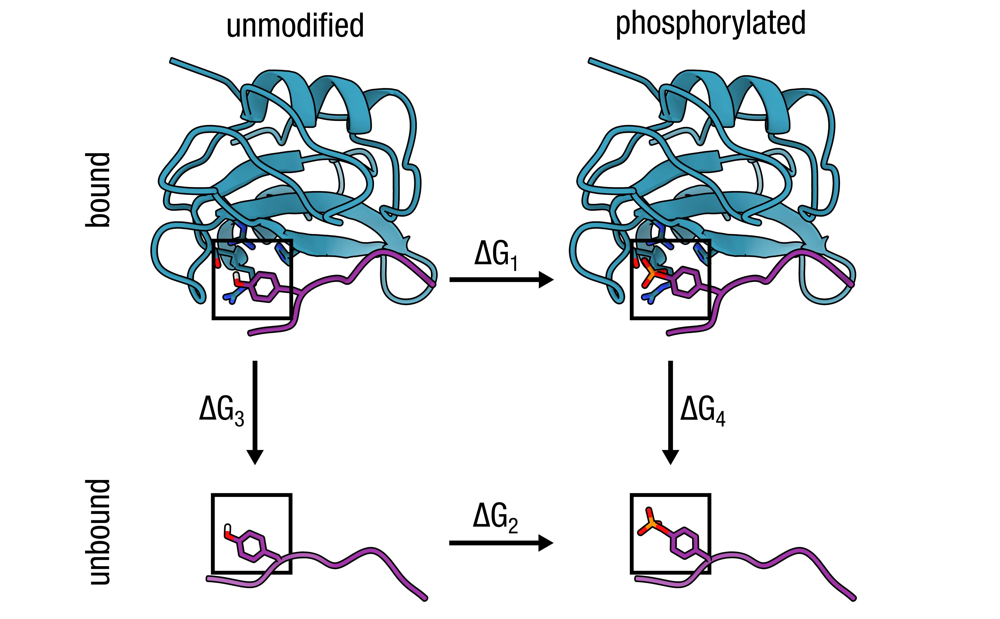

# Alchemical tyrosine phosphorylation: Tyr → phosphoTyr (TP1) in Lck SH2 domain (1AOT)

<p align="center">
  
</p>

## TLDR

This example computes the phosphorylation ΔΔG (Tyr → monoanionic phosphotyrosine TP1) using CHARMM36m's built-in TP1 residue in the Lck SH2 domain (PDB 1AOT) — no force-field patching required. The hybrid `Y2P1` morphs the tyrosine phenol into a phosphate by converting `HH` to a non-interacting dummy and promoting five dummy phosphate atoms (DP, DO2, DH2, DO3, DO4) to real ones, capturing the electrostatic change that drives SH2-domain phosphorylation recognition.

| | |
|---|---|
| **Hybrid** | `Y2P1` |
| **State A** | Tyr: `OH` type `OH1`, `HH` present; charge 0 |
| **State B** | TP1: `OH` → `ON2B`, `HH` → `DUM_H`, dummy `DP/DO2/DH2/DO3/DO4` → real; charge −1 |
| **Charge shift** | 0 → −1 (add one K⁺ counter-ion for the state B leg) |
| **Special steps** | None — TP1 is already in `charmm36m-mut`; use `P2` / `Y2P2` for dianionic (−2) form |

```bash
# Unique mutation step — see run.sh for the full pipeline
printf "63 P1\n" | pmx mutate \
    -f  wt.gro \
    -o  mutant.pdb \
    -ff charmm36m-mut
```

---

## Detailed walkthrough

### Step 1 — Fetch the structure and prepare the wildtype topology

Download 1AOT (Lck SH2 domain), then run `pdb2gmx` to normalise atom names. `wt.top` is discarded; only `wt.gro` feeds into `pmx mutate`.

```bash
bash input/fetch_input.sh   # downloads 1AOT, extracts chain A, prints Tyr positions

eval "$(python3 -c 'from pmx.gmx import set_gmxlib; import os; set_gmxlib(); print("export GMXLIB="+os.environ["GMXLIB"])')"

gmx pdb2gmx \
    -f      input/1AOT_A.pdb \
    -o      wt.gro \
    -p      wt.top \
    -ff     charmm36m-mut \
    -water  tip3p \
    -ignh
```

Check the Tyr list printed by `fetch_input.sh` to confirm the pmx-renumbered position of your target residue (the script uses 1-based sequential numbering matching pmx's convention).

---

### Step 2 — Build the hybrid structure

Mutation code `P1` selects the `Y2P1` hybrid (Tyr → monoanionic phosphotyrosine). Replace `63` with the residue number identified in Step 1.

```bash
printf "63 P1\n" | pmx mutate \
    -f      wt.gro \
    -o      mutant.pdb \
    -ff     charmm36m-mut
```

`pmx mutate` changes `OH` from type `OH1` to the dummy-bearing `ON2B`, converts `HH` to a zero-charge dummy, and adds five dummy phosphate atoms around the phenol oxygen. Do **not** pass `-ignh` in subsequent steps.

---

### Step 3 — Build the hybrid topology

`pdb2gmx` reads the `Y2P1` residue definition from `mutres.rtp` in `charmm36m-mut` and generates a standard GROMACS topology.

```bash
gmx pdb2gmx \
    -f      mutant.pdb \
    -o      processed.gro \
    -p      topol.top \
    -ff     charmm36m-mut \
    -water  tip3p
```

---

### Step 4 — Fill B-state bonded terms

`pmx gentop` reads `Y2P1` from `mutres.mtp` and fills in all B-state atom types, charges, and bonded parameters.

```bash
pmx gentop \
    -p  topol.top \
    -o  pmxtop.top \
    -ff charmm36m-mut
```

Expected output:
```
log_> Hybrid Residue -> 63 | Y2P1
log_> Making bonds for state B -> ...
log_> Total charge of state A =  0
log_> Total charge of state B = -1
```

---

### Step 5 — Solvate and add ions

Add one extra K⁺ to neutralise the −1 charge gained in state B.

```bash
gmx solvate -cp processed.gro -cs spc216.gro -p pmxtop.top -o solvated.gro

gmx grompp -f mdp/em.mdp -c solvated.gro -r solvated.gro \
           -p pmxtop.top -o ions.tpr -maxwarn 1
printf '13\n' | gmx genion -s ions.tpr -pname K -nname CL \
           -neutral -o ions.gro -p pmxtop.top
```

---

### Step 6 — Energy minimise

```bash
gmx grompp -f mdp/em.mdp -c ions.gro -r ions.gro \
           -p pmxtop.top -o em.tpr -maxwarn 1
gmx mdrun -v -deffnm em -ntmpi 1
```

---

### Step 7 — Equilibrate and run endpoint simulations

Tyrosine phosphorylation introduces a large electrostatic change; allow at least 10 ns equilibration per endpoint before harvesting transition frames.

```bash
mkdir -p stateA
gmx grompp -f mdp/eqA.mdp -c em.gro -r em.gro \
           -p pmxtop.top -o stateA/md.tpr -maxwarn 1
gmx mdrun -v -deffnm stateA/md

mkdir -p stateB
gmx grompp -f mdp/eqB.mdp -c em.gro -r em.gro \
           -p pmxtop.top -o stateB/md.tpr -maxwarn 1
gmx mdrun -v -deffnm stateB/md
```

---

### Step 8 — Non-equilibrium transition simulations

```bash
mkdir -p transitionA
printf '0\n' | gmx trjconv -f stateA/md.trr -s stateA/md.tpr \
    -b 5000 -sep -o transitionA/frame.pdb

for i in $(seq 0 99); do
    mkdir -p transitionA/frame${i}
    mv transitionA/frame${i}.pdb transitionA/frame${i}/initial.pdb
    gmx grompp -f mdp/tiA.mdp \
        -c transitionA/frame${i}/initial.pdb \
        -r transitionA/frame${i}/initial.pdb \
        -p pmxtop.top -o transitionA/frame${i}/ti.tpr -maxwarn 1
    gmx mdrun -v -deffnm transitionA/frame${i}/ti
done

mkdir -p transitionB
printf '0\n' | gmx trjconv -f stateB/md.trr -s stateB/md.tpr \
    -b 5000 -sep -o transitionB/frame.pdb

for i in $(seq 0 99); do
    mkdir -p transitionB/frame${i}
    mv transitionB/frame${i}.pdb transitionB/frame${i}/initial.pdb
    gmx grompp -f mdp/tiB.mdp \
        -c transitionB/frame${i}/initial.pdb \
        -r transitionB/frame${i}/initial.pdb \
        -p pmxtop.top -o transitionB/frame${i}/ti.tpr -maxwarn 1
    gmx mdrun -v -deffnm transitionB/frame${i}/ti
done
```

---

### Step 9 — Analyse

`results.txt` gives ΔG1 (Tyr→TP1 free energy cost in the protein). Repeat Steps 1–9 with a short Tyr-containing reference peptide in water to get ΔG2, then ΔΔG = ΔG1 − ΔG2.

```bash
pmx analyze \
    -fA transitionA/frame*/ti.xvg \
    -fB transitionB/frame*/ti.xvg
```

```
ΔΔG = ΔG1 − ΔG2
```

A negative ΔΔG indicates that the SH2 domain environment specifically stabilises the phosphorylated state — the thermodynamic signature of phospho-recognition.
